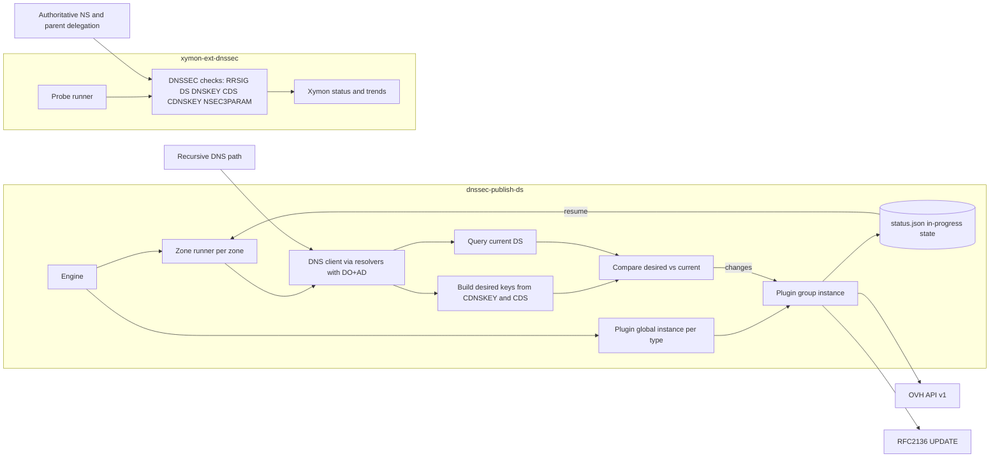

# dnssec-publish-ds

A DNSSEC operations toolkit with two production-focused components:

- `dnssec-publish-ds`: a Go daemon that monitors child-published CDS/CDNSKEY and aligns parent DS records through provider plugins.
- `xymon-ext-dnssec`: a Xymon probe (Perl) that validates DNSSEC delegation and signing health across authoritative servers.

This repository is intended for both operators and developers who need practical DNSSEC automation plus DNSSEC observability.

## Detailed documentation

- Daemon deep dive: [README.dnssec-publish-ds.md](README.dnssec-publish-ds.md)
- Xymon probe deep dive: [README.xymon-ext-dnssec.md](README.xymon-ext-dnssec.md)
- Manpages:
  - `man/dnssec-publish-ds.8.md`
  - `man/xymon-ext-dnssec.1.md`

## Why this project exists

DNSSEC is no longer the hard part. It is a mature standard that should be deployed by default.

The trust chain works at Internet scale: root servers are solid, registries are mostly ready, and registrars usually support DNSSEC in production.

The real gap is operational ownership of the DS lifecycle. CDS/CDNSKEY publication exists on the child side, but parent-side updates are still too often left to manual copy/paste workflows.

That last mile creates two problems at once:

- It burns operator time on low-value repetitive tasks.
- It introduces timing risk during rollovers.

`dnssec-publish-ds` exists to close that last mile for local operations: consume child intent, update parent DS records automatically, and keep delegation state aligned over time.

This project addresses both sides:

- **Publishing path**: detect DS drift and push updates (`dnssec-publish-ds`).
- **Monitoring path**: continuously verify DNSSEC chain and rollover signals (`xymon-ext-dnssec`).

## High-level architecture



## Quick start

## Method 1: download binary from GitHub Release artifacts

```bash
VERSION=vX.Y.Z
ARCH=amd64

wget "https://github.com/BugMaster510945/dnssec-publish-ds/releases/download/${VERSION}/dnssec-publish-ds-linux-${ARCH}" -O dnssec-publish-ds
chmod +x ./dnssec-publish-ds
./dnssec-publish-ds --config ./config/config.toml --log-level info
```

Useful flags:

- `--dump-config` to render merged config as JSON and exit.
- `--skip-initial-jitter` to bypass startup delay (mostly for testing).

## Method 2: download Debian package from GitHub Release artifacts

```bash
VERSION=vX.Y.Z

wget "https://github.com/BugMaster510945/dnssec-publish-ds/releases/download/${VERSION}/dnssec-publish-ds_${VERSION#v}_amd64.deb" -O dnssec-publish-ds.deb
sudo apt install -y ./dnssec-publish-ds.deb
sudo systemctl enable --now dnssec-publish-ds
```

Service file reference: `debian/dnssec-publish-ds.service`.

## Method 3: run container from GHCR

```bash
IMAGE=ghcr.io/bugmaster510945/dnssec-publish-ds
TAG=latest
docker run --rm \
  --name dnssec-publish-ds \
  --read-only \
  --tmpfs /tmp:rw,noexec,nosuid,size=16m \
  -v "$(pwd)/config/config.toml:/etc/dnssec-publish-ds/config.toml:ro" \
  -v dnssec-publish-ds-state:/var/lib/dnssec-publish-ds \
  ${IMAGE}:${TAG} --log-level info
```

Notes:

- The status file persists in the named volume mounted at `/var/lib/dnssec-publish-ds`.
- The runtime image is non-root distroless.

## Method 4: build from source

```bash
go test ./...
go build -o dnssec-publish-ds .
./dnssec-publish-ds --config ./config/config.toml --log-level info
```

## Xymon probe quick run

```bash
perl xymon/server/ext/xymon-ext-dnssec --config ./config/xymon-ext-dnssec.yaml --zone example.com
```

## RFC coverage and boundaries

The table below is intentionally conservative and based on current implementation behavior.

| Topic | Status | Notes |
|:--|:--|:--|
| CDS/CDNSKEY consumption (RFC 7344 / RFC 8078 family) | Partial | Daemon reads both CDS and CDNSKEY and computes desired DS set; currently enforces strict coherence between the two sets when both are used. |
| DS publication automation | Implemented | DS updates are sent through provider plugins (`ovh-v1`, `rfc2136`). |
| DNS dynamic update (RFC 2136) | Implemented | `rfc2136` plugin sends synchronous UPDATE requests to authoritative server. |
| TSIG authentication (RFC 2845) | Implemented | Supported in `rfc2136` plugin and in Xymon authoritative queries (per-server options). |
| SIG(0) authentication (RFC 2931) | Not implemented | Explicitly rejected in current `rfc2136` plugin config parsing. |
| NSEC3 operational guidance (RFC 9276) | Implemented in probe | Xymon probe checks NSEC3PARAM iterations/salt compliance. |
| Algorithm policy guidance (RFC 8624 naming) | Implemented in probe | Xymon probe supports allow-list policy for DNSSEC algorithms. |
| Multi-signer workflows (e.g. RFC 8901 style operations) | Partial / not orchestrated | Probe checks cross-NS consistency and rollover signals, but no dedicated multi-signer orchestration protocol is implemented in daemon. |

## Explicit exceptions and current limitations

- DNSSEC removal sentinel (algorithm `0` in CDS/CDNSKEY) is detected but **not executed** by the daemon.
- The daemon currently requires DNS responses with AD for its recursive lookups (CDS/CDNSKEY/DS path).
- OVH plugin requires CDNSKEY material (not CDS-only), because provider payload needs DNSKEY fields.
- RFC2136 plugin supports `none` and `TSIG` authentication modes only; `SIG(0)` is not available.
- No built-in root-to-leaf DNSSEC validator in daemon; behavior is practical AD-based validation from configured/system resolvers.
- No complete end-to-end multi-signer state machine in daemon.

## Project status

Active engineering repository focused on pragmatic DNSSEC operations.
API and config details can evolve; rely on manpages and dedicated READMEs for the most accurate behavior contracts.

## License

This project is licensed under the GNU Affero General Public License, version 3 (AGPL-3.0).
See [LICENSE](LICENSE) for the full text.
